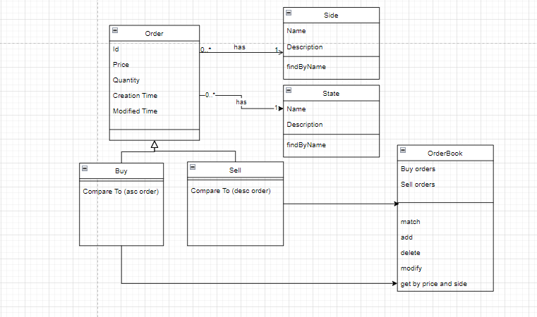

**Order book assessment**

**a. Efficiency Mechanisms**
Decided to use a sorted set as orders will be stored in sorted order, first on price then on creation time.
This will ensure that searching is faster as it is faster to search sorted fata. 

**b. Solution approach**

**The Order book should keep all distinct orders ordered on their price level** -
I decided to use a sorted set for this as a set does not store duplicates or null values
and I implemented the compareTo method uses price to ensure that any interaction with the 
set results in a sorted dataset by price.

**When an Order is added a unique ID should be generated for each order** -
I opted to use Java's inbuilt UUID unique ID generator to ensure distinct IDs each time. 
I create and set this ID in the constructor of order objects to ensure that a user will never be able 
to set it manually. To further ensure the integrity of the ID I did not add a set method as this value is 
'system' generated.

**The delete operation should take as input the order ID** -
amended the delete method to take in an Order instead, so I can access the order side and only remove the order 
from the corresponding set.

**The modify operation should only allow for modification of the quantity and take in as parameters 
the id and the new quantity, this will cause losing the priority of the original order** -
As modification should result in a change of priority(based on modified date) of the orders I amend the order quantity 
and update the modified date of that order to establish a new order in the set. 

**c. Data Structures**
Sorted set - set does not allow duplicates as required and since it is sorted
it will store elements in a sorted order as defined by the overridden compareTo method.
Also, a sorted set allows for fast searching, adding and deleting elements, due to the underlying 
hash table structure.

**The Order book should allow users to access all orders at a given price level & side; 
ordered by their priorities** -
for this action, I decided to use a parallel stream to filter the original sets by price. 
Order will be maintained due to the main sorted set collection that is being filtered to create this list. 

**Matching Engine**
for this action I first get the orders to be matched by price abd side i.e. if a Sell order comes in 
I need buy orders that with the same price I can match with. Fully matched orders will then have their state
set to fully filled and will be removed from the order list. Partially filled orders will be match and with the new 
remaining quantity will be kept in the set with their nre priority as the modified date will be changed. 
Should an order that came in have remaining quantity it will then be added to the corresponding order book so it to can be 
matched based on price and priority should a new order come in. 